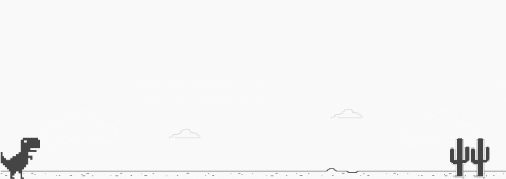

 <h1 align="center">DINO GAME :cactus: 🦖</h1>

<!--Banner session-->

  

<!--About session-->

<h1 align="center">Recriando o famoso jogo do dinossauro sem internet</h1>

Neste projeto você terá o desafio de criar uma cópia do jogo do dinossauro, famoso no Chrome por nos entreter quando estamos sem conexão. 
Nele iremos utilizar HTML, CSS e JavaScript, abordando de maneira simples diversos conceitos introdutórios importantes para programação na 
web como tags básicas de HTML, manipulação de eventos, funções e manipulação de elementos HTML usando JavaScript, estilização e animações básicas com CSS.

<h3>👨‍💻 Tecnologias utilizadas</h3>

- [HTML](https://www.w3schools.com/html/)
- [CSS](https://developer.mozilla.org/pt-BR/docs/Web/CSS)
- [JavaScript](https://developer.mozilla.org/en-US/docs/Web/JavaScript)
